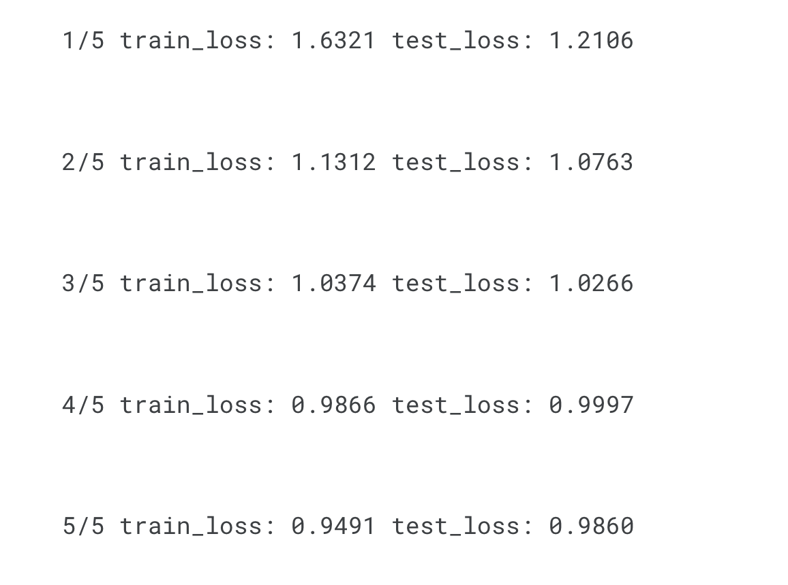

## image-captioning

This repo contains the code for creating an image captioning model using **ViT** and **GPT** models. <br>
Both the models are trained from scratch. The general architecture of the model in this repo is given in the image below


## Repository Setup

Clone the repository to your local machine and install the required dependencies using the following commands:

```bash
git clone https://github.com/SkAndMl/image-captioning.git
cd image-captioning
pip install -r requirements.txt
```

## Hyperparameter Configuration
Adjust the **scripts/constants.py** according to your system configuration and dataset path.

## Training
To train the image captioning model, navigate to the repository's root directory and run the following command:
```bash
python -m scripts.train --epochs 5 --lr 0.0001 --model_file_name "custom_caption_model"
```
**Parameters**
1. --epochs: Number of training epochs.
2. --lr: Learning rate for the optimizer.
3. --model_file_name: Base name for saving the trained model checkpoints.

Given below is the sample training carried out with the keyword aguments mentioned in the **scripts/constants.py** file. As you can see from the training results further optimization is required on the hyperparameter side and the scale of the data



This command will train the image captioning model and save the checkpoints in the **checkpoints** directory under the specified model file name.

## Inference
To caption an image using the training model under the **checkpoints** directory, use the following command

```bash
python3.11 inference.py --file_path "sample.jpeg" --max_len 40 --device "cpu" --checkpoint "checkpoints/image_caption_model.pt"
```