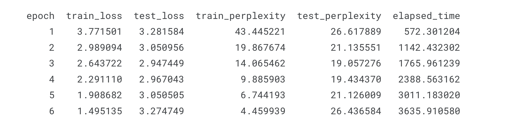

## captiongpt

This repo contains the code for creating an image captioning model using **ViT** and **GPT** models. <br>
Both the models are trained from scratch. The general architecture of the model in this repo is given in the image below


## Repository Setup

Clone the repository to your local machine and install the required dependencies using the following commands:

```bash
git clone https://github.com/SkAndMl/captiongpt.git
cd captiongpt
pip install -r requirements.txt
```

## Hyperparameter Configuration
Adjust the **captiongpt/params.py** according to your system configuration and dataset path.

## Training
To train the image captioning model, navigate to the repository's root directory and run the following command:
```bash
python -m captiongpt.trainer --epochs 5 --freeze_epochs 2 --lr 0.0001 --model_file_name "image_caption_model.pt" --device "cuda:0"
```
**Parameters**
1. --epochs: Number of training epochs.
2. --lr: Learning rate for the optimizer.
3. --model_file_name: Base name for saving the trained model checkpoints.
4. --freeze_epochs: Number of epochs to freeze the ViT pretrained model before updating its params
5. --device: The device to run the training

This command will train the image captioning model and save the checkpoints in the **checkpoints** directory under the specified model file name

Given below is the training carried out with the keyword aguments mentioned in the **captiongpt/params.py** file. As you can see from the training results the model has overfit, which will be addressed in future improvements. The training was carried out using P100 GPU offered by Kaggle. 




## Inference
To caption an image using the training model under the **checkpoints** directory, use the following command

```bash
python3.11 inference.py --file_path "example_pictures/1.jpeg" --max_len 40 --device "cpu" --checkpoint "checkpoints/image_caption_model.pt"
```

## Results

Below are some examples of images captioned by our model. Each entry shows the original image and the caption generated by the model.

| Image | Generated Caption |
|-------|-------------------|
|  | [BOS]  A man in a blue sweatshirt and blue jeans is standing on a path with a forest in the background. [EOS] |
|  | [BOS]  A black and white dog runs on the grass in front of a wooden house. [EOS] |
|  | [BOS]  A group of people sitting on the beach in front of a lake. [EOS] |
|  | [BOS]  A little girl in a white dress is playing with a little boy in a red shirt. [EOS] |
|  | [BOS]  A young boy jumps off a diving board into a swimming pool while a boy in a blue T-shirt jumps off. [EOS] |
